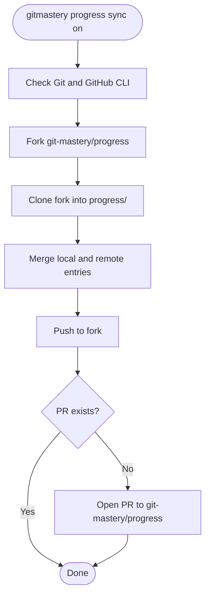

# Progress tracking

The app records exercise progress locally after every `verify` run, and can optionally sync it to a GitHub-hosted progress repository.

## Local progress

`gitmastery setup` creates a `progress/` folder inside the Git-Mastery root with an empty `progress.json`.

After each `gitmastery verify`, the app appends a new entry:

```json
{
  "exercise_name": "branch-bender",
  "started_at": 1700000000.0,
  "completed_at": 1700000010.0,
  "comments": ["Great work!"],
  "status": "Completed"
}
```

The `status` field maps from `GitAutograderStatus`:

| `GitAutograderStatus` | Written as     |
| --------------------- | -------------- |
| `SUCCESSFUL`          | `"Completed"`  |
| `UNSUCCESSFUL`        | `"Incomplete"` |
| `ERROR`               | `"Error"`      |

{: .note }
If the exercise already has a `Completed` entry, subsequent attempts are not recorded.

`gitmastery progress show` displays the latest entry per exercise.

## Remote sync



Once sync is on, every subsequent `verify` run pushes the new progress entry to the fork. `progress reset` also removes the exercise entry from the fork.

`gitmastery progress sync off` removes the fork from GitHub, switches `.gitmastery.json` back to local-only mode, and recreates a plain local `progress/` folder preserving existing entries.

## Reset

`gitmastery progress reset` removes the current exercise's entries from `progress.json` and recreates the exercise workspace.

{: .reference }

See [Download and verification flow](/developers/docs/app/download-and-verify-flow) for how progress is updated during the verify step.
