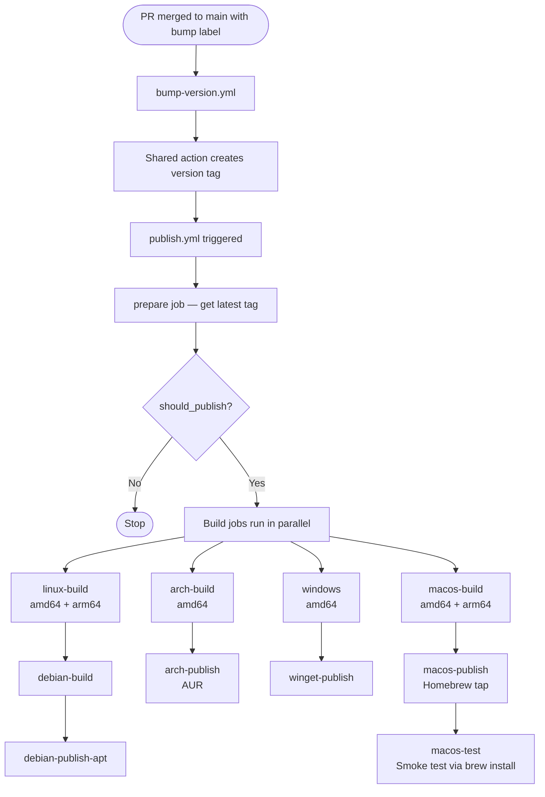

# Publishing flow

Releases are fully automated. Merging a labelled PR to `main` triggers a version bump, which in turn triggers a multi-platform build and publish.

## How to trigger a release

Label the PR with one of:

| Label        | Effect                                             |
| ------------ | -------------------------------------------------- |
| `bump:major` | Bumps the major version (e.g. `v1.2.3` → `v2.0.0`) |
| `bump:minor` | Bumps the minor version (e.g. `v1.2.3` → `v1.3.0`) |
| `bump:patch` | Bumps the patch version (e.g. `v1.2.3` → `v1.2.4`) |

When the labelled PR is merged to `main`, the pipeline runs automatically.

{: .warning }
Do not push version tags manually. The automated pipeline manages tag creation. Manually pushed tags may trigger duplicate publish jobs.

## Pipeline overview



## Workflow files

| File                                 | Purpose                                                                                       |
| ------------------------------------ | --------------------------------------------------------------------------------------------- |
| `.github/workflows/bump-version.yml` | Listens for closed PRs on `main`, delegates to the shared `git-mastery/actions` bump workflow |
| `.github/workflows/publish.yml`      | Triggered after the bump tag is created; builds and publishes all platform targets            |

## Build and publish targets

### Linux (amd64 and arm64)

1. `linux-build`: builds the binary with PyInstaller on `ubuntu-latest` and `ubuntu-24.04-arm`, writes the version into `app/version.py`, and uploads both binaries to the GitHub Release.
2. `debian-build`: downloads the Linux binary artifact, packages it as a `.deb` file using `dpkg-buildpackage`, and uploads the `.deb` to the GitHub Release.
3. `debian-publish-apt`: pushes the `.deb` to the `gitmastery-apt-repo` via a reusable workflow so it is available via APT.

### Arch Linux (amd64)

1. `arch-build`: builds the binary inside an `archlinux:base-devel` Docker container, uploads it to the GitHub Release.
2. `arch-publish`: clones the AUR package repository via SSH, updates `PKGBUILD` and `.SRCINFO`, and force-pushes to publish the new version on the AUR.

### Windows (amd64)

1. `windows`: builds `gitmastery.exe` on `windows-latest`, uploads it to the GitHub Release.
2. `winget-publish`: submits the new version to WinGet via the `vedantmgoyal9/winget-releaser` action.

### macOS (amd64 and arm64)

1. `macos-build`: builds architecture-specific binaries (`gitmastery-amd64`, `gitmastery-arm64`) on `macos-15-intel` and `macos-latest`, computes SHA256 checksums, and uploads both to the GitHub Release.
2. `macos-publish`: clones the `git-mastery/homebrew-gitmastery` tap repository, writes a new `gitmastery.rb` formula with the correct download URLs and checksums, and pushes to the tap.
3. `macos-test`: runs a smoke test on both macOS architectures by installing via `brew tap git-mastery/gitmastery && brew install gitmastery && gitmastery --help`.

## How the version is embedded

During every build job, the version is written directly into `app/version.py` before PyInstaller runs:

```bash
# Unix
echo "__version__ = \"$REF_NAME\"" > app/version.py

# Windows (PowerShell)
'__version__ = "{0}"' -f $env:REF_NAME | Out-File app/version.py -Encoding utf8
```

This means the version in the binary always matches the release tag and does not rely on runtime package metadata.

## The `prepare` gate

The `publish.yml` workflow starts with a `prepare` job that calls the shared `get-latest-tag` workflow. This job outputs `should_publish` and `ref_name`. All downstream build jobs check `if: needs.prepare.outputs.should_publish == 'true'` before running.

This gate prevents accidental re-runs of publish jobs when the workflow is triggered manually (`workflow_dispatch`) without a new tag.

## Secrets and environments

| Secret            | Used by                                                       |
| ----------------- | ------------------------------------------------------------- |
| `GITHUB_TOKEN`    | Creating GitHub Releases (automatic, no configuration needed) |
| `ORG_PAT`         | Updating the Homebrew tap and WinGet submission               |
| `SSH_PRIVATE_KEY` | Pushing to the AUR repository                                 |

The `arch-publish` job runs in the `Main` environment, which gates secret access.

## Contributor expectations

- **Do not modify `app/version.py` manually** — it is overwritten during every release build.
- **Do not change publishing logic without review** — changes to `publish.yml` affect all distribution channels simultaneously.
- **Label PRs correctly** — missing or wrong bump labels mean no release is triggered after merge.
- **Packaging changes** (Debian control files, AUR PKGBUILD, Homebrew formula) should be tested locally where possible and reviewed carefully before merging.
