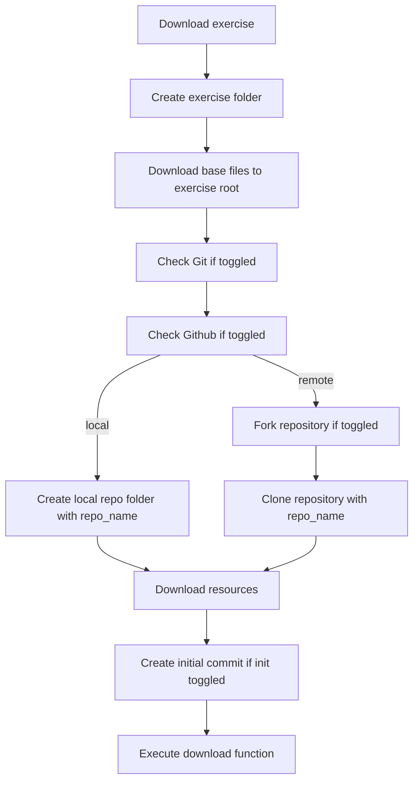

# Download Workflow

```mermaid
flowchart
a[Download exercise] --> b[Create exercise folder]
b --> c[Download base files to exercise root]
c --> d[Check Git if toggled]
d --> e[Check Github if toggled]
e -- local --> f[Create local repo folder with repo_name]
e -- remote --> g[Fork repository if toggled]
g --> h[Clone repository with repo_name]
f --> i[Download resources]
h --> i
i --> j[Create initial commit if init toggled]
j --> k[Execute download function]
```

