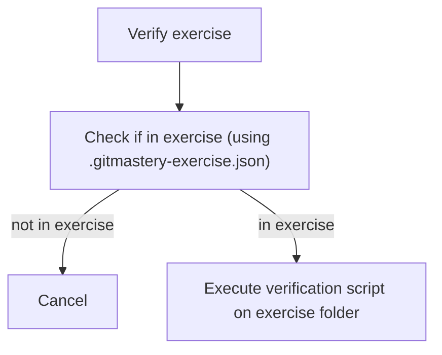

# Verification Workflow

```mermaid
flowchart
a[Verify exercise] --> b["Check if in exercise (using .gitmastery-exercise.json)"]
b -- not in exercise --> c[Cancel]
b -- in exercise --> d[Execute verification script on exercise folder]
```
