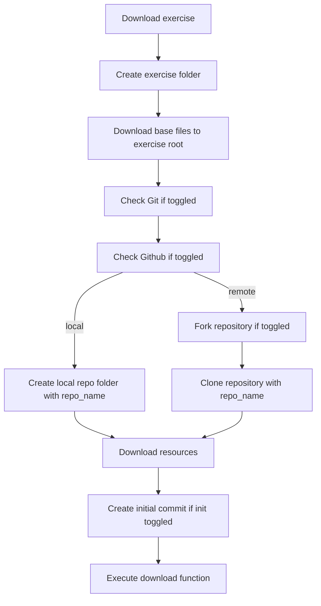
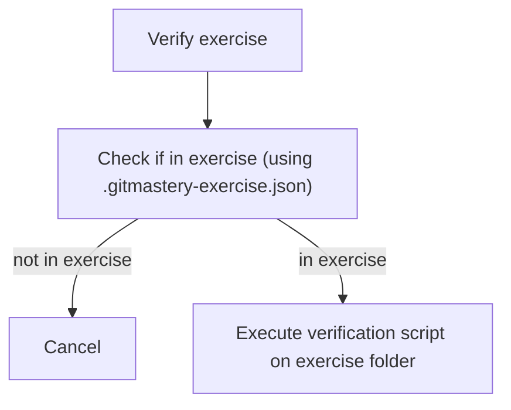

# Contributing an exercise

## Before contributing

If you are proposing a new exercise (i.e., not implementing an [already approved exercise proposal](https://github.com/git-mastery/exercises/issues?q=is%3Aissue%20state%3Aopen%20label%3A%22exercise%20discussion%22%20label%3A%22help%20wanted%22)) make sure that you have done the following:
- [ ] Create an [exercise discussion](https://github.com/git-mastery/exercises/issues/new?template=exercise_discussion.yaml)
- [ ] Obtained approval on the exercise
- [ ] File a [remote repository request](https://github.com/git-mastery/exercises/issues/new?template=request_exercise_repository.yaml)


## Create a new exercise

Use the provided `new.sh` script to generate the scaffolding for a new exercise:

```bash
./new.sh
```

This script will prompt you for:

1. The name of the exercise -- likely to be specified in the corresponding exercise discussion
2. The exercise tags (split by space) -- likely to be specified in the corresponding exercise discussion
3. The exercise configuration (read the [`.gitmastery-exercise.json` configuration](#gitmastery-exercisejson-configuration) section for more info on this)

{: .note }

You should use kebab case for the exercise name.

It then generates the following directory structure:

```text
<exercise name>
├── .gitmastery-exercise.json
├── README.md
├── __init__.py
├── download.py
├── res
│   └── ...
├── tests
│   ├── specs
│   │   └── base.yml
│   └── test_verify.py
└── verify.py
```

- `.gitmastery-exercise.json`: contains the exercise configuration; refer [here](/developers/docs/architecture/gitmastery-exercise-configuration/) for information about the configuration structure
- `README.md`: contains the instructions for the exercise for the students to attempt
- `download.py`: contains the download instructions to setup the student's exercise
- `verify.py`: contains the verification script for the exercise attempt
- `res/`: contains resources that are available to students (see this section about [types of resources](#types-of-resources))
- `tests/specs/`: contains specification files written using [`repo-smith`](https://github.com/git-mastery/git-autograder)
- `tests/test_verify.py`: contains unit tests for verification script

## Designing download process

The `download.py` contains the instructions to setup the local repository.

This is the sequence in which the Git-Mastery app downloads an exercise for a student:



As a result, the `download` function is the last step after you have already setup the folder structures and downloaded the base files and resources.

The default download script comes with a helper function to `run_command` to run local commands.

> [!NOTE]
> You should be using OS-agnostic commands in the download script

The initial download script also includes a command to attach a tag as the "start tag". This is only useful if you want to iterate through the user's commits in your verification script. Otherwise, this can be removed.

Refer to existing `download.py` for reference on how to setup the download script.

### What students see

When a student downloads an exercise, they will see the following folder structure:

```text
<exercise name>
├── .gitmastery-exercise.json
├── README.md
└── <sub folder name>
    ├── .git
    └── ...
```

The root of the exercise will contain the `README.md` and `.gitmastery-exercise.json` configured from your template.

It also contains the sub-folder configured in `.gitmastery-exercise.json`, which is where students will attempt the exercise.

### Types of resources

There are two distinct types of resources:

1. Base files: configured through the `base_files` property in `.gitmastery-exercise.json` in your template; files located in `res/` are downloaded to the root of the exercise folder

    ```text
    <exercise name>
    ├── .gitmastery-exercise.json
    ├── README.md
    ├── <base files> <-- here
    └── <sub folder name>
        ├── .git
        └── ...
    ```

2. Resources: configured through the `__resources__` field in `download.py`; supporting files for the exercise with files located in `res/` downloaded into the sub folder

    ```text
    <exercise name>
    ├── .gitmastery-exercise.json
    ├── README.md
    ├── <base files>
    └── <sub folder name>
        ├── .git
        └── <resources> <-- here
    ```

### Testing downloads

To test that your download script works, we have provided a script to simulate the download process in this repository for you to verify.

```bash
./test-download.sh <your exercise folder>
```

You can find the downloaded repository under the `test-downloads/` folder.

> [!NOTE]
> If you wish to support a remote repository and require the Git-Mastery team to create a new repository, create an issue and we will assess the request accordingly


## Designing verification process 

The verification process is controlled by the `verify.py`:



The [`git-autograder`](https://github.com/git-mastery/git-autograder) is built as a wrapper around [`GitPython`](https://github.com/gitpython-developers/GitPython). As a result, if you are writing any verification scripts and there is no available helper function with `git-autograder`, you can fall back to the underlying `Repo` object:

```python
def verify(exercise: GitAutograderExercise) -> GitAutograderOutput:
    # Access the underlying GitPython repo:
    exercise.repo.repo

    return exercise.to_output([], GitAutograderStatus.SUCCESSFUL)
```

Refer to existing `verify.py` scripts to understand what are the available helper functions to streamline the grading. Open an issue if there is something that is not yet supported or if you have a question.

### Testing verification

To test the verification, we rely on [`repo-smith`](https://github.com/git-mastery/repo-smith) to simulate exercise states and write unit tests to verify the verification script's behavior. You don't need to simulate the entire flow, just the end states that you require for your verification script.

Refer to existing `test_verify.py` to see examples of unit testing the verification script.

You can run the unit tests of your exercise via:

```bash
./test.sh <your exercise folder>
```

## Submitting the exercise for review

Create a pull request from your fork using the provided pull request template.

Fill in all of the details necessary.
