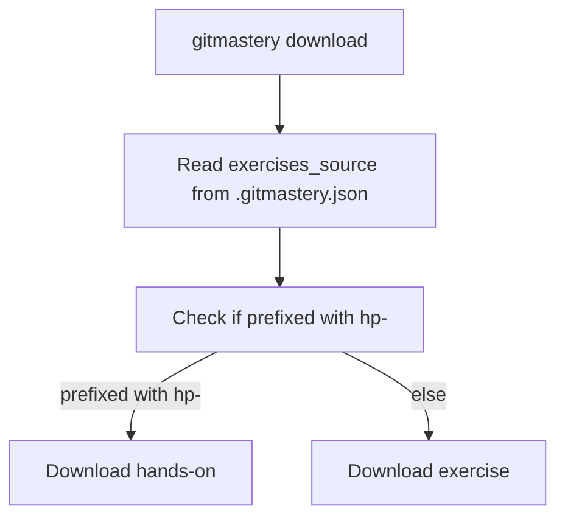
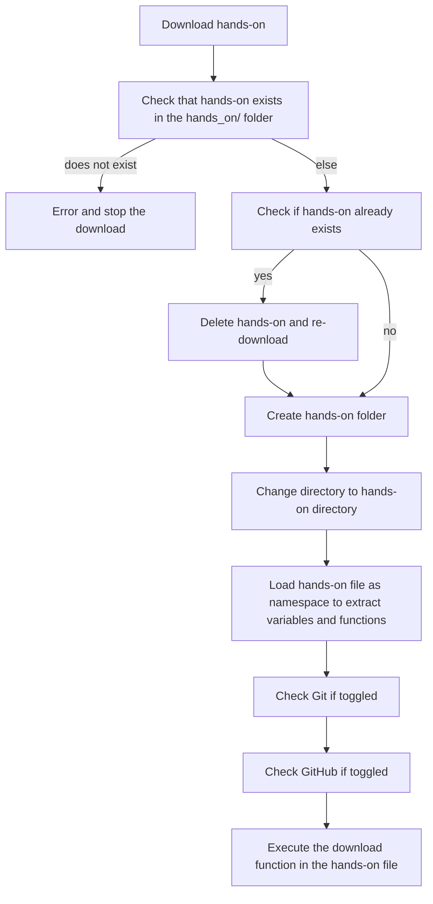
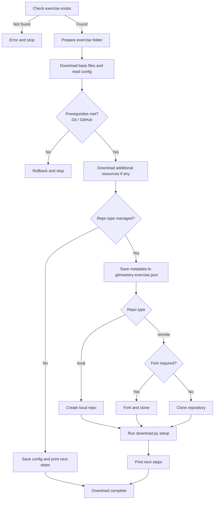

# Download flow

## General download sequence

Both hands-ons and exercises are downloaded using the same `gitmastery download` command.

Hands-ons use the `hp-` prefix before the hands-on name.

{: .note }

> The source that exercises and hands-ons are fetched from is controlled by `exercises_source` in `.gitmastery.json`. See [`exercises_source`](/developers/docs/app/configuration#exercises_source) for the full details and override options.

Refer to the following sections for the specific download sequences.

## Hands-on download

These are handled within the app's `download.py` command through the `download_hands_on` function.

## Exercise download

These are handled within the app's `download.py` command through the `download_exercise` function.

