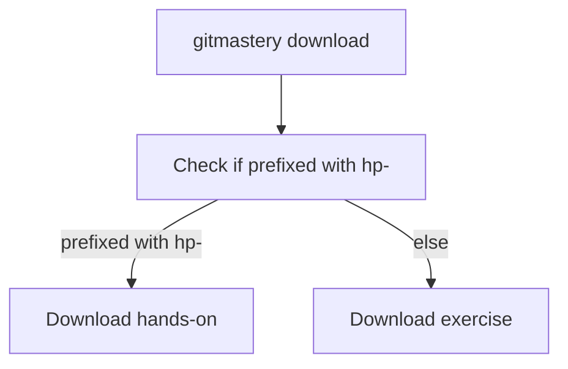
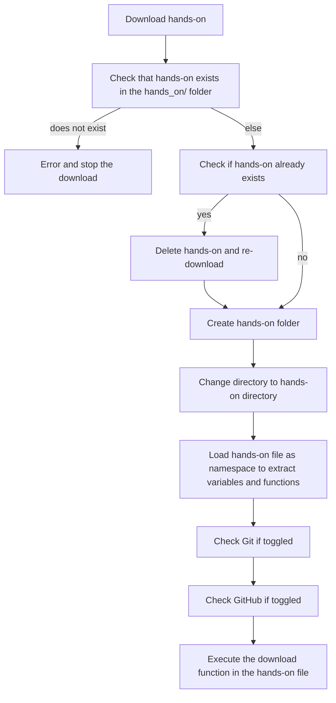
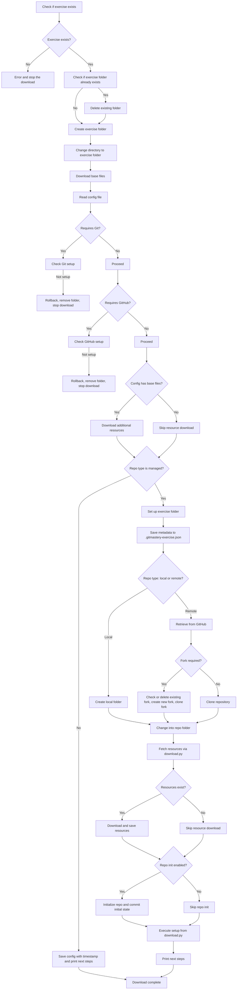

## General download sequence

Both hands-ons and exercises are downloaded using the same `gitmastery download` command.

Hands-ons use the `hp-` prefix before the hands-on name.

Refer to the following sections for the specific download sequences.

## Hands-on download

These are handled within the app's `download.py` command through the `download_hands_on` function.

## Exercise download

These are handled within the app's `download.py` command through the `download_exercise` function.

