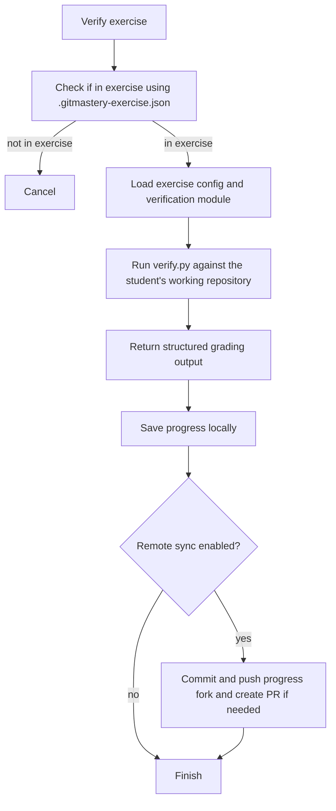

# Verification flow

Exercise verification is driven by the student's local exercise metadata and the exercise's `verify.py` script.

## In practice

- The app first confirms that the current directory belongs to a Git-Mastery exercise.
- It loads the local exercise metadata and the corresponding verification logic from the exercises source.
- `verify.py` receives a `GitAutograderExercise` object, which loads `.gitmastery-exercise.json` and prepares either a real repository wrapper or a null repository wrapper for `ignore` exercises.
- `verify.py` uses `git-autograder` to inspect repository state, parse `answers.txt` when needed, and produce structured comments and a status.
- `GitAutograderWrongAnswerException` becomes an unsuccessful verification result, while invalid state and unexpected exceptions become error results.
- After verification, the app appends an entry to local `progress/progress.json` and optionally syncs it to the student's progress fork.
- Exercise unit tests use `repo-smith` to construct end states that validate verification behavior.
