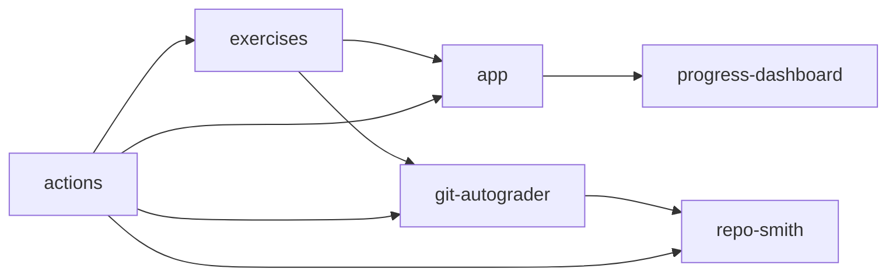

# Ecosystem map

The main Git-Mastery repositories work together as follows:

## How to read the map

- `exercises` is where contributors define hands-ons, exercises, resources, and verification tests.
- `app` downloads and verifies hands-ons and exercises through the `gitmastery` CLI.
- `git-autograder` provides the verification model used by exercise `verify.py` scripts.
- `repo-smith` creates repository states for unit tests that validate `verify.py` behavior.
- `progress-dashboard` and `actions` support the wider platform, but are not first-class documentation sections yet.

## Common contributor journeys

- Writing a new exercise usually touches `exercises`, `git-autograder`, and sometimes `repo-smith`.
- Changing how students download, verify, or track progress usually starts in `app`.
- Adding a reusable repository-state primitive belongs in `repo-smith`.
- Adding a reusable grading abstraction belongs in `git-autograder`.
