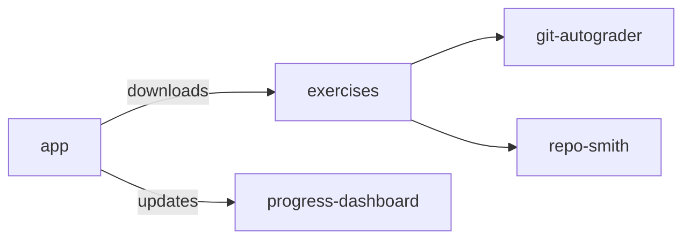

# System overview

The main Git-Mastery repositories work together as follows:

1. `app` downloads and verifies hands-ons and exercises through the `gitmastery` CLI.
2. `exercises` is where contributors define hands-ons, exercises, resources, and verification tests.
3. `git-autograder` provides the verification model used by exercise `verify.py` scripts.
4. `repo-smith` creates repository states for unit tests that validate `verify.py` behavior.
5. `progress-dashboard` visualizes learner progress data sent by the `gitmastery` CLI.
